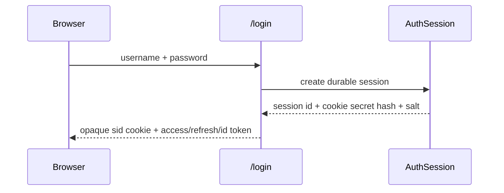
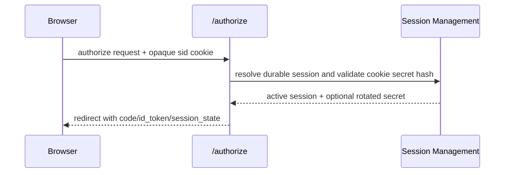
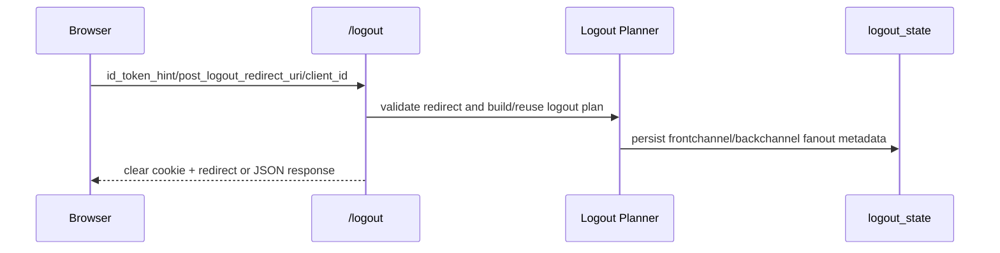

> [!WARNING]
> Archived historical reference. This document is retained for audit history only and is **not** an authoritative current-state artifact.
> Use `docs/compliance/AUTHORITATIVE_CURRENT_DOCS.md` for the current source of truth.

# Browser Session and Logout Flows

## Browser session establishment

## Authorization with session_state

## Logout with fanout planning

## Abuse-case handling

- malformed opaque cookies are rejected during browser-session resolution
- unregistered `post_logout_redirect_uri` values are rejected
- repeated logout attempts reuse the durable logout record instead of fanout duplication
- cross-site cookie mode is explicit and only enabled when configured or required for logout interoperability
